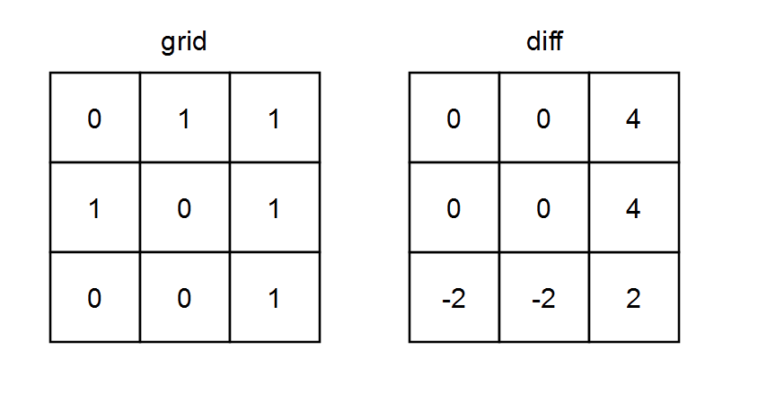
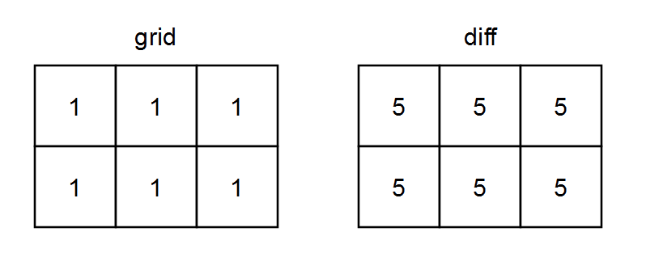

# [2482. Difference Between Ones and Zeros in Row and Column](https://leetcode.com/problems/difference-between-ones-and-zeros-in-row-and-column/description/)

**Difficulty:** :yellow_circle: Medium

You are given a **0-indexed** `m x n` binary matrix `grid`.

A **0-indexed** `m x n` difference matrix `diff` is created with the following procedure:

- Let the number of ones in the `ith` row be `onesRowi`.
- Let the number of ones in the `jth` column be `onesColj`.
- Let the number of zeros in the `ith` row be `zerosRowi`.
- Let the number of zeros in the `jth` column be `zerosColj`.
- `diff[i][j] = onesRowi + onesColj - zerosRowi - zerosColj`

Return *the difference matrix* `diff`.


## Examples:

**Example 1:**



```
Input: grid = [[0,1,1],[1,0,1],[0,0,1]]
Output: [[0,0,4],[0,0,4],[-2,-2,2]]
Explanation:
- diff[0][0] =onesRow0 + onesCol0 - zerosRow0 - zerosCol0 = 2 + 1 - 1 - 2 = 0
- diff[0][1] =onesRow0 + onesCol1 - zerosRow0 - zerosCol1 = 2 + 1 - 1 - 2 = 0
- diff[0][2] =onesRow0 + onesCol2 - zerosRow0 - zerosCol2 = 2 + 3 - 1 - 0 = 4
- diff[1][0] =onesRow1 + onesCol0 - zerosRow1 - zerosCol0 = 2 + 1 - 1 - 2 = 0
- diff[1][1] =onesRow1 + onesCol1 - zerosRow1 - zerosCol1 = 2 + 1 - 1 - 2 = 0
- diff[1][2] =onesRow1 + onesCol2 - zerosRow1 - zerosCol2 = 2 + 3 - 1 - 0 = 4
- diff[2][0] =onesRow2 + onesCol0 - zerosRow2 - zerosCol0 = 1 + 1 - 2 - 2 = -2
- diff[2][1] =onesRow2 + onesCol1 - zerosRow2 - zerosCol1 = 1 + 1 - 2 - 2 = -2
- diff[2][2] =onesRow2 + onesCol2 - zerosRow2 - zerosCol2 = 1 + 3 - 2 - 0 = 2

```

**Example 2:**



```
Input: grid = [[1,1,1],[1,1,1]]
Output: [[5,5,5],[5,5,5]]
Explanation:
- diff[0][0] = onesRow0 + onesCol0 - zerosRow0 - zerosCol0 = 3 + 2 - 0 - 0 = 5
- diff[0][1] = onesRow0 + onesCol1 - zerosRow0 - zerosCol1 = 3 + 2 - 0 - 0 = 5
- diff[0][2] = onesRow0 + onesCol2 - zerosRow0 - zerosCol2 = 3 + 2 - 0 - 0 = 5
- diff[1][0] = onesRow1 + onesCol0 - zerosRow1 - zerosCol0 = 3 + 2 - 0 - 0 = 5
- diff[1][1] = onesRow1 + onesCol1 - zerosRow1 - zerosCol1 = 3 + 2 - 0 - 0 = 5
- diff[1][2] = onesRow1 + onesCol2 - zerosRow1 - zerosCol2 = 3 + 2 - 0 - 0 = 5

```


## Constraints:

- `m == grid.length`
- `n == grid[i].length`
- `1 <= m, n <= 105`
- `1 <= m * n <= 105`
- `grid[i][j]` is either `0` or `1`.


## Solutions

### O(m x n) solution

The algorithm calculates the difference between the count of ones and zeros in each row and column of a given grid and constructs a new matrix with the calculated differences. Let's analyze the algorithm's time and space complexity, taking into account the given constraints:

Counting Zeros and Ones in Rows: The algorithm iterates over each row of the grid, which has m rows and n columns. For each row, it counts the occurrences of zeros and ones using the count method, which has a time complexity of O(n). Since this step is performed for each of the m rows, the overall time complexity is O(m * n). Considering the constraints, this results in a maximum time complexity of O(105).

Counting Zeros and Ones in Columns: The algorithm iterates over each column of the grid. For each column, it initializes counters for zeros and ones. It then iterates over each row and increments the counters based on the value in the grid. This step also has a time complexity of O(m * n) since it involves nested loops over m rows and n columns. Considering the constraints, this results in a maximum time complexity of O(105).

Constructing the Result Matrix: The algorithm creates a new matrix of the same size as the input grid, with dimensions m rows and n columns. It then iterates over each element of the matrix and calculates the difference between the counts of ones and zeros in the corresponding row and column. This step requires nested loops over m rows and n columns, resulting in a time complexity of O(m * n). Considering the constraints, this also results in a maximum time complexity of O(105).

Returning the Result: Finally, the algorithm returns the constructed matrix, which requires constant time.

Therefore, the overall time complexity of the algorithm is dominated by the steps involving nested loops, resulting in a time complexity of O(m * n) or O(105) in terms of the given constraints.

In terms of space complexity, the algorithm utilizes additional memory to store the rows and cols dictionaries, each of which has a size of m or n, respectively. It also creates a new matrix of the same size as the input grid. Therefore, the space complexity is O(m * n) or O(105) as well, considering the constraints.

To summarize:

Time complexity: O(m * n) or O(105) - Quadratic time complexity, where m is the number of rows and n is the number of columns in the grid. The maximum time complexity is limited by the given constraints.
Space complexity: O(m * n) or O(105) - Quadratic space complexity. The maximum space complexity is limited by the given constraints.
The algorithm efficiently counts the occurrences of zeros and ones in each row and column of the grid and constructs a new matrix with the calculated differences. It complies with the given constraints, ensuring that the time and space complexities do not exceed the maximum limits specified.

```python3
class Solution:
    def onesMinusZeros(self, grid: List[List[int]]) -> List[List[int]]:
        m, n = len(grid), len(grid[0])
        cols, rows = {}, {}

        for i in range(m):
            rows[i] = {0: grid[i].count(0), 1: grid[i].count(1)}

        for j in range(n):
            cols[j] = {0: 0, 1: 0}
            for i in range(m):
                cols[j][0] += 1 if grid[i][j] == 0 else 0
                cols[j][1] += 1 if grid[i][j] == 1 else 0
        
        matrix = [[0] * n for _ in range(m)]
        for i in range(m):
            for j in range(n):
                matrix[i][j] = rows[i][1] + cols[j][1] - rows[i][0] - cols[j][0]

        return matrix 
```

***NB***: If you want to get community points please suggest solutions in other languages as merge requests.
