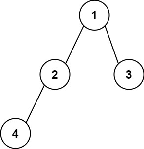
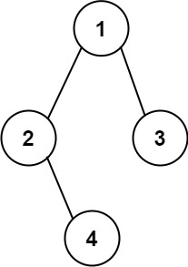

# [606. Construct String from Binary Tree](https://leetcode.com/problems/construct-string-from-binary-tree/)

**Difficulty:** :green_circle: Easy

Given the `root` of a binary tree, construct a string consisting of parenthesis and integers from a binary tree with the preorder traversal way, and return it.

Omit all the empty parenthesis pairs that do not affect the one-to-one mapping relationship between the string and the original binary tree.


## Examples:

**Example 1:**



```
Input: root = [1,2,3,4]
Output: "1(2(4))(3)"
Explanation: Originally, it needs to be "1(2(4)())(3()())", but you need to omit all the unnecessary empty parenthesis pairs. And it will be "1(2(4))(3)"
```

**Example 2:**



```
Input: root = [1,2,3,null,4]
Output: "1(2()(4))(3)"
Explanation: Almost the same as the first example, except we cannot omit the first parenthesis pair to break the one-to-one mapping relationship between the input and the output.
```


## Constraints:

- The number of nodes in the tree is in the range `[1, 104]`.
- `1000 <= Node.val <= 1000`


## Solutions

### O(n) solution 

**Python3**

```python3
# Definition for a binary tree node.
# class TreeNode:
#     def __init__(self, val=0, left=None, right=None):
#         self.val = val
#         self.left = left
#         self.right = right

class Solution:
    def tree2str(self, root: Optional[TreeNode]) -> str:
        def construct(node, buffer):
            if not node: return 0

            buffer.append(node.val)
            if node.left:
                buffer.append("(")
                construct(node.left, buffer)
                buffer.append(")")

            if node.right and not node.left:
                buffer.append("(")
                buffer.append(")")

            if node.right:
                buffer.append("(")
                construct(node.right, buffer)
                buffer.append(")")

        buffer = []
        construct(root, buffer)
        return "".join(map(str, buffer))
```

The given solution provides an approach to construct a string representation of a binary tree using the preorder traversal method, omitting empty parenthesis pairs.

Here is a step-by-step overview of the solution:

1. Define a recursive helper function `construct` that takes a node and a buffer to store the constructed string.
2. If the node is None, return 0.
3. Append the value of the current node to the buffer.
4. If the left child of the node exists:
   - Append "(" to the buffer.
   - Recursively call `construct` for the left child.
   - Append ")" to the buffer.
5. If the right child of the node exists:
   - If the left child doesn't exist, append "()" to the buffer.
   - Append "(" to the buffer.
   - Recursively call `construct` for the right child.
   - Append ")" to the buffer.

Finally, call the `construct` function for the root of the binary tree and return the constructed string.

#### Complexity Analysis

The time complexity for this solution is O(n), where n is the number of nodes in the binary tree. We visit each node once.

The space complexity is O(h), where h is the height of the binary tree. This is the maximum recursion depth.

#### Summary

The given solution provides an approach to construct a string representation of a binary tree using the preorder traversal method. It recursively builds the string, omitting empty parenthesis pairs that do not affect the one-to-one mapping relationship between the string and the original binary tree. The solution has a time complexity of O(n) and a space complexity of O(h), where n is the number of nodes and h is the height of the binary tree.

***NB***: If you want to get community points please suggest solutions in other languages as merge requests.
