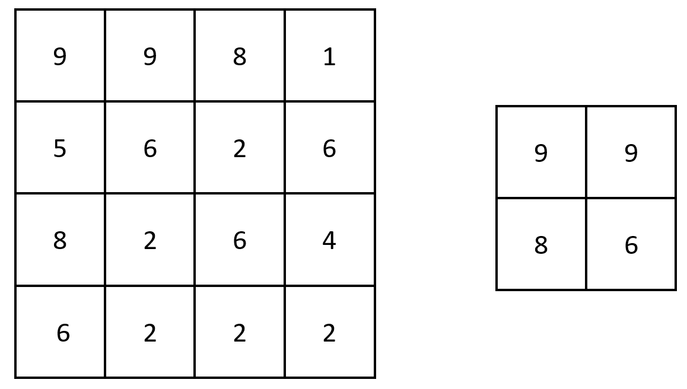
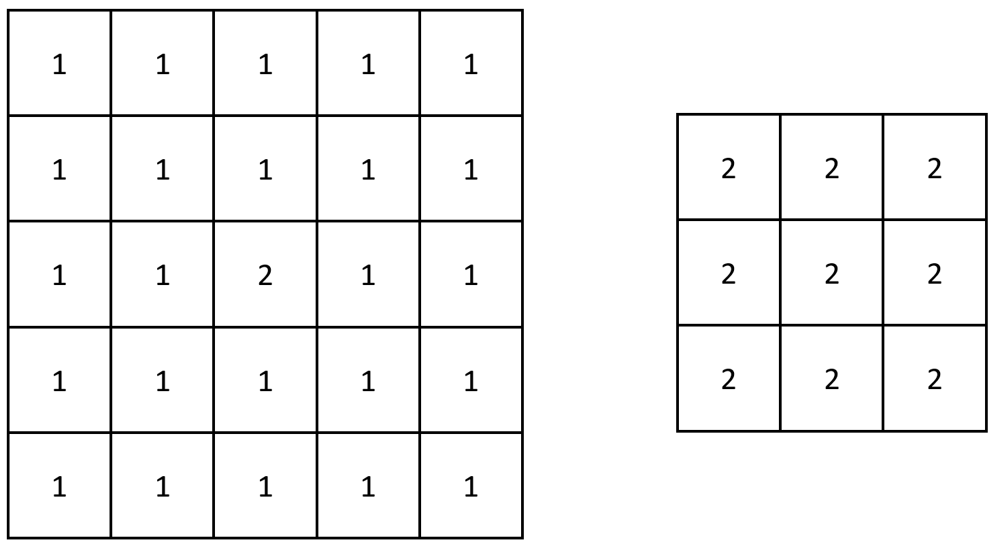

# [2373. Largest Local Values in a Matrix](https://leetcode.com/problems/largest-local-values-in-a-matrix/)

**Difficulty:** :green_circle: Easy


You are given an `n x n` integer matrix `grid`.
Generate an integer matrix `maxLocal` of size `(n - 2) x (n - 2)` such that:

- `maxLocal[i][j]` is equal to the **largest** value of the `3 x 3` matrix in `grid` centered around row `i + 1` and column `j + 1`.

In other words, we want to find the largest value in every contiguous `3 x 3` matrix in `grid`.
Return *the generated matrix*.


## Examples:

**Example 1:**



```
Input: grid = [[9,9,8,1],[5,6,2,6],[8,2,6,4],[6,2,2,2]]
Output: [[9,9],[8,6]]
Explanation: The diagram above shows the original matrix and the generated matrix.
Notice that each value in the generated matrix corresponds to the largest value of a contiguous 3 x 3 matrix in grid.
```

**Example 2:**



```
Input: grid = [[1,1,1,1,1],[1,1,1,1,1],[1,1,2,1,1],[1,1,1,1,1],[1,1,1,1,1]]
Output: [[2,2,2],[2,2,2],[2,2,2]]
Explanation: Notice that the 2 is contained within every contiguous 3 x 3 matrix in grid.
```


## Constraints:

- `n == grid.length == grid[i].length`
- `3 <= n <= 100`
- `1 <= grid[i][j] <= 100`


## Solutions

### O(n^2) solution 

**Python3**

```python3
class Solution:
    def largestLocal(self, grid: List[List[int]]) -> List[List[int]]:
        def get_max(grid, row_index, col_index, area_size=3):
            maximum = 0
            for i in range(row_index, row_index+area_size):
                for j in range(col_index, col_index+area_size):
                    maximum = max(maximum, grid[i][j])
            return maximum

        max_local_size = len(grid) - 2
        max_local = [[0] * max_local_size for _ in range(max_local_size)] 

        for row_index in range(max_local_size):
            for col_index in range(max_local_size):
                max_local[row_index][col_index] = get_max(grid, row_index, col_index)

        return max_local
```

The solution involves iterating through the elements of the input `grid` to find the maximum value in each `3 x 3` matrix.

Here's a step-by-step explanation of the solution:

1. Initialize an empty matrix `maxLocal` of size `(n - 2) x (n - 2)` where `n` is the number of rows and columns in the input `grid`.

2. Define a helper function `get_max(grid, row_index, col_index, area_size=3)` that takes the input matrix `grid`, the starting row index `row_index`, the starting column index `col_index`, and an optional parameter `area_size` (default value is 3). This function calculates and returns the maximum value within the `area_size x area_size` matrix starting from `(row_index, col_index)`.

3. Iterate through the rows and columns of `maxLocal` using nested loops. For each `(i, j)` position in `maxLocal`, calculate the maximum value within the `3 x 3` matrix centered at `(i + 1, j + 1)` using the `get_max` helper function and assign it to `maxLocal[i][j]`.

4. After iterating through all positions, return the `maxLocal` matrix, which contains the maximum values for each `3 x 3` matrix in the input `grid`.

#### Complexity Analysis

- Time Complexity: The solution iterates through each position `(i, j)` in the `maxLocal` matrix and calculates the maximum value for each `3 x 3` matrix. The time complexity is O(n^2) since there are `(n - 2) x (n - 2)` positions to consider.

- Space Complexity: The space complexity is O(1) since the `maxLocal` matrix is of fixed size `(n - 2) x (n - 2)` and does not depend on the input size.

#### Summary

The solution efficiently calculates the maximum value for each `3 x 3` matrix centered at different positions in the input `grid`. It uses a helper function to find the maximum value within a specified matrix area and fills the `maxLocal` matrix with these maximum values. The time complexity of the solution is O(n^2), where n is the size of the input matrix.


***NB***: If you want to get community points please suggest solutions in other languages as merge requests.
